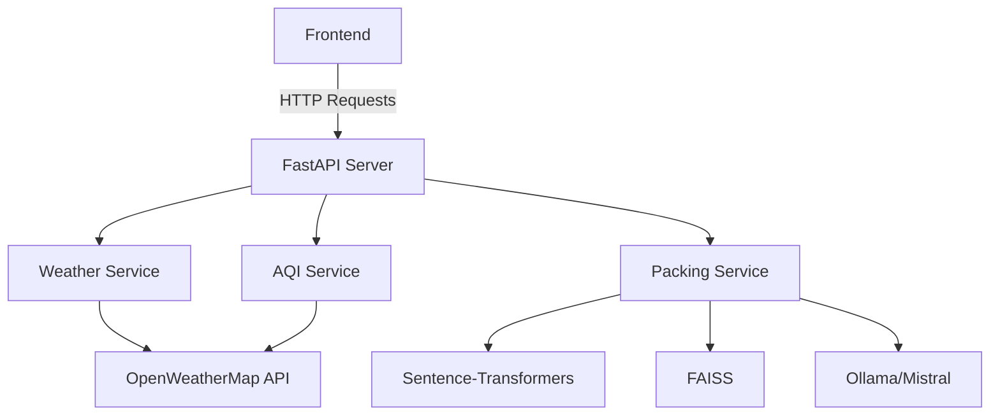

# TravelBuddy - Smart Travel Assistant 🧳✈️

## Table of Contents
- [Project Overview](#project-overview)
- [Key Features](#key-features)
- [Technologies Used](#technologies-used)
- [System Architecture](#system-architecture)
- [Challenges & Solutions](#challenges--solutions)
- [Installation Guide](#installation-guide)
- [API Endpoints](#api-endpoints)
- [Frontend Structure](#frontend-structure)
- [Future Improvements](#future-improvements)

## Project Overview
TravelBuddy is an intelligent travel assistant that provides personalized packing recommendations based on weather conditions, air quality, and destination characteristics. The system combines real-time API data with AI-powered suggestions to help travelers prepare effectively for their trips.

## Key Features
- 🌦️ Real-time weather data integration
- 🌫️ Air quality index monitoring
- 🧠 AI-generated packing suggestions
- 🔍 Semantic search for relevant recommendations
- 🛡️ Graceful fallback mechanisms
- 📱 Responsive web interface

## Technologies Used

### Backend Stack
| Technology | Purpose | Implementation Details |
|------------|---------|------------------------|
| FastAPI | Web framework | REST API endpoints, request handling |
| Uvicorn | ASGI server | Production-grade server implementation |
| Sentence-Transformers | Text embeddings | Convert text to numerical representations |
| FAISS | Similarity search | Efficient nearest neighbor search for recommendations |
| Ollama | LLM integration | Mistral model for refining suggestions |
| OpenWeatherMap API | Weather data | Current weather conditions |
| OpenWeatherMap Air Pollution API | AQI data | Air quality metrics |

### Frontend Stack
| Technology | Purpose | Implementation Details |
|------------|---------|------------------------|
| HTML5 | Structure | Semantic document structure |
| CSS3 | Styling | Responsive design with media queries |
| JavaScript | Interactivity | API calls and DOM manipulation |
| Fetch API | Data retrieval | Asynchronous data fetching |

### DevOps
| Technology | Purpose | Implementation Details |
|------------|---------|------------------------|
| Git | Version control | Code management and collaboration |
| GitHub | Repository hosting | Cloud-based code storage |
| pip | Package management | Python dependency management |

## System Architecture


## Challenges & Solutions (Macbook Air M2)

### 1. Dependency Hell
**Problem:** Severe version conflicts between transformers, sentence-transformers, numpy, and other ML packages.

**Solution:**
- Created a clean conda environment
- Pinned specific versions:
  ```python
  numpy==1.23.5
  sentence-transformers==2.2.2
  transformers==4.30.2
  ```
- Used conda-forge for FAISS installation

### 2. FAISS Installation Issues
**Problem:** Installation failures on Mac M1/M2 architecture.

**Solution:**
```bash
conda install -c conda-forge faiss-cpu
brew install cmake libomp
```

### 3. Model Download Bottlenecks
**Problem:** Slow downloads of sentence-transformers models during initialization.

**Solution:**
- Implemented local caching
- Added progress bars
- Provided fallback mechanism during downloads

### 4. Ollama Integration Challenges
**Problem:** Inconsistent responses from Mistral model.

**Solution:**
- Implemented response parsing with regex
- Added comprehensive error handling
- Created fallback templates

### 5. Frontend-Backend Communication
**Problem:** Response format mismatches causing UI issues.

**Solution:**
- Standardized API response format:
  ```json
  {
    "weather": {...},
    "aqi": {...},
    "packing": {
      "packing_list": [...],
      "travel_tips": [...],
      "source": "AI-generated|Fallback"
    }
  }
  ```
- Added detailed error states in UI

## Installation Guide

### Prerequisites
- Python 3.10+
- Ollama installed and running
- OpenWeatherMap API key

### Setup Instructions
1. Clone repository:
   ```bash
   git clone https://github.com/yourusername/travelbuddy.git
   cd travelbuddy
   ```

2. Create conda environment:
   ```bash
   conda create -n travelbuddy python=3.10
   conda activate travelbuddy
   ```

3. Install dependencies:
   ```bash
   pip install -r requirements.txt
   conda install -c conda-forge faiss-cpu
   ```

4. Set up environment variables:
   ```bash
   echo "OPENWEATHER_API_KEY=your_api_key" > .env
   ```

5. Download Ollama model:
   ```bash
   ollama pull mistral
   ```

6. Run the application:
   ```bash
   uvicorn main:app --reload
   ```

## API Endpoints

### `GET /`
- Serves the frontend interface

### `GET /api/{city}`
- Returns weather, AQI, and packing suggestions
- Example response:
  ```json
  {
    "weather": {
      "temp": 22.5,
      "feels_like": 24.1,
      "condition": "Cloudy",
      "description": "scattered clouds",
      "humidity": 65,
      "wind_speed": 3.2
    },
    "aqi": {
      "aqi": 2,
      "level": "Fair",
      "components": {
        "co": 230.21,
        "no": 1.23,
        "no2": 12.4,
        "o3": 54.2,
        "so2": 3.1,
        "pm2_5": 12.3,
        "pm10": 18.7,
        "nh3": 0.92
      }
    },
    "packing": {
      "packing_list": ["Light jacket", "Umbrella", ...],
      "travel_tips": ["Check morning forecasts", ...],
      "source": "AI-generated"
    }
  }
  ```
Key components:
- Dynamic result display with loading states
- AQI visualization with color coding
- Responsive design for mobile/desktop
- Error handling and user feedback

## Future Improvements
1. **User Accounts** - Save travel preferences
2. **Multi-day Forecasts** - Packing for longer trips
3. **Destination Photos** - Visual context for locations
4. **Packing List Export** - PDF/checklist generation
5. **Mobile App** - Native iOS/Android versions
6. **Translation Support** - Multilingual interface
7. **Collaborative Packing** - Share lists with travel companions

## Contributors
- [Samar Patil](https://github.com/samaarr)

## License
MIT License - See LICENSE file for details

---
